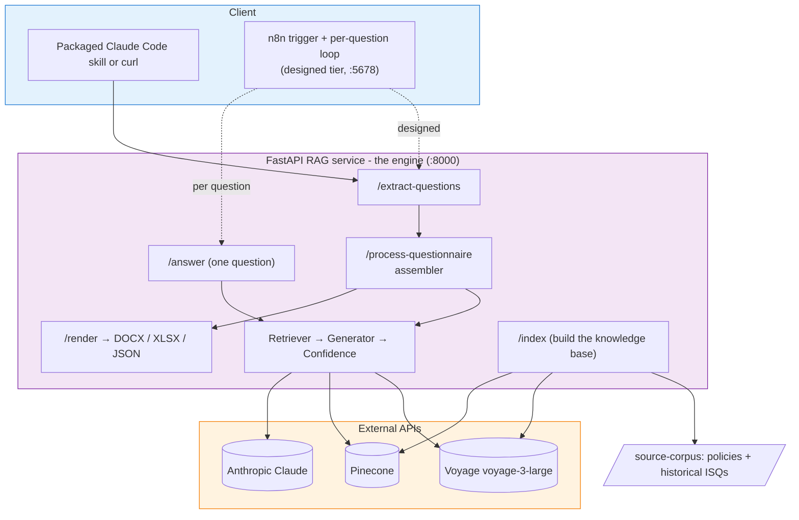

# ISQ Agent

> AI-powered workflow that ingests supplier security questionnaires (PDF or XLSX),
> grounds every answer in Northstar Labs' policies and historical responses, and
> renders the filled response in three formats with honest confidence flagging.

[](https://github.com/ThomasJButler/isq-agent/actions/workflows/ci.yml)

[](https://github.com/ThomasJButler/isq-agent/tags)


Built by Tom Butler for the RiverAI AI Engineer technical challenge.

## Why it exists

The CV you've already seen was generated by JobSearch2026, a system I built that grounds
writing in a knowledge base, holds it to a voice constraint, and ships it in several formats.
The ISQ Agent is that same pattern pointed at a different problem: supplier security
questionnaires instead of job applications. So this isn't a one-off answer to an assessment,
it's a repeatable approach I've shipped before, applied to your domain.

## What it does

- Takes a blank ISQ (PDF or XLSX) and pulls the questions out with a forced Claude tool call, so one extraction path covers both formats.
- Grounds every answer in Northstar Labs' six policy documents and three historical completed ISQs, retrieved from a Voyage + Pinecone knowledge base.
- Drafts professional, evidence-backed answers with Claude, each carrying the citations it actually used.
- Scores each answer's confidence across four dimensions and flags the shaky ones for human review instead of pretending they're fine.
- Renders the finished response three ways: a clean DOCX report, an XLSX overlay on the original workbook, and a lossless JSON envelope.
- Records tokens, cost and latency for every question, so a run is auditable rather than a black box.

## Architecture



Two tiers. The engine is a Python FastAPI service (`rag-service`, port 8000): it owns
extraction, retrieval, generation, confidence scoring and rendering, and it's where the RAG
expertise from my other projects already lived, so that's where it stays. The orchestration
tier is n8n (port 5678), designed to drive the upload-to-download flow. In v1 the working path
runs through the service's own `/process-questionnaire` assembler, called either by the
packaged Claude Code skill or by `curl`, with n8n as the designed front door rather than the
shipped one. Both tiers come up together under `docker compose`, every external dependency
(Voyage, Pinecone, Claude) sits behind the service, and an `X-Request-Id` threads through so a
single questionnaire run is traceable end to end.

## Run it locally

```bash
git clone https://github.com/ThomasJButler/isq-agent.git
cd isq-agent
cp .env.example .env   # add VOYAGE_API_KEY, ANTHROPIC_API_KEY, PINECONE_API_KEY
docker compose up      # rag-service on :8000, n8n on :5678

# build the knowledge base from source-corpus/ (once)
curl -X POST http://localhost:8000/index \
  -H "Content-Type: application/json" -d '{"force_reindex": true}'
```

Then process a questionnaire. The clean path is the packaged Claude Code skill, which runs
extract then answer then render and writes the three output files to `./outputs/`:

```bash
cd skill && zip -r ../isq-agent.skill isq-agent/ -x '*__pycache__*'
claude skill install ./isq-agent.skill
# then, in any Claude Code chat: "process the Sunflowers questionnaire"
```

Prefer raw HTTP? The full contract (every endpoint, request and response shape) is in
[`skill/isq-agent/references/service_contract.md`](skill/isq-agent/references/service_contract.md):
`POST /extract-questions` to get the question list, `POST /process-questionnaire` to answer the
lot and assemble the canonical envelope, then `POST /render` for a downloadable file.

## Tech stack

n8n (workflow) · Python 3.11 + FastAPI (RAG service) · Anthropic Claude Sonnet 4.5 (model-selectable via `ANTHROPIC_MODEL`) ·
Voyage AI `voyage-3-large` (embeddings) · Pinecone (vector store) · python-docx + openpyxl
(rendering) · Docker Compose.

## How it was built

Eleven planning iterations before any code, all captured in [`/plans`](plans/). TDD throughout:
every module's tests were written before the implementation, watched fail, then made green.
GitHub Flow with squash-merged PRs, Conventional Commits, pre-commit hooks (ruff, a full pytest
run, and a guard that blocks any Matrix-themed wording leaking in from the reused modules), and
GitHub Actions CI on every push. 243 tests run green.

## Design decisions

The full writeup is in [`docs/architecture.md`](docs/architecture.md). The decisions worth
calling out:

- **Two tiers** - n8n for orchestration, a Python FastAPI service for the AI logic, so each layer does what it's best at and the RAG core stays where the expertise is.
- **Hybrid confidence** - the model self-scores, then a retrieval similarity check docks the grounding score when the answer over-claims. A self-rating on its own is too easy to game.
- **Source weighting at three layers** - retrieval (policies preferred over historical ISQs), the prompt (cite the policy text), and the self-score (`cites_policy` weighted heaviest).
- **Honest rendering** - XLSX overlays the original workbook (so it goes straight back to the supplier), DOCX is a clean typeset report, JSON is the lossless envelope. A typeset PDF is on the v1.1 backlog rather than faked.
- **Cross-system observability** - an `X-Request-Id` propagates across both tiers so one run is traceable.

Every answer carries a confidence score (0.0 to 1.0) and a `needs_review` flag. The score is a
weighted mean of four dimensions, with grounding weighted heaviest because an ungrounded answer
is the worst failure for an audit-facing tool:

| Dimension | Weight | What it measures |
|---|---|---|
| `cites_policy` | 0.40 | Is the answer grounded in a policy or historical ISQ? |
| `on_topic` | 0.25 | Does it answer the question actually asked? |
| `vendor_tone` | 0.20 | Does it read as a professional vendor response? |
| `complete` | 0.15 | Is it complete? (partial-but-correct beats complete-but-wrong) |

An answer is flagged if any one of three triggers fires: the aggregate is below `0.6`,
`cites_policy` is below `0.5` (ungrounded even if otherwise strong), or the model itself raised
a review reason (for example a scope mismatch). The weights and thresholds live in
[`rag-service/app/confidence/aggregator.py`](rag-service/app/confidence/aggregator.py) so the
bias is auditable.

## Dashboard

A Next.js dashboard ships in [`frontend/`](frontend/), deployed at
https://isq-agent-xyz.vercel.app/ (running on demo data for now; wiring it to the live backend is
the v1.1 step). Three visual iterations were produced; the lead is the "Claude × RiverAI Hybrid":
a Claude warm-paper foundation with RiverAI black-pill CTAs, a blue interactive accent, and a
single "Powered by Claude" badge. The full design handoff (tokens, components, five screens,
interactive prototype) is in
[`design/design_handoff_isq_agent/`](design/design_handoff_isq_agent/).

## Reused components

This build reuses code and patterns from my other projects. The full record is in
[`docs/attributions.md`](docs/attributions.md):

- **Morpheus** - the RAG core (chunking, document processing, Pinecone client, query rewriter).
- **NewsPerspective** - single-call multi-field analysis (one call returns answer, citations, confidence and review reason together).
- **ReviewBot Protocol** - multi-dimension scoring, adapted for confidence.
- **SQL-Ball** - strict-rules-in-prompt grounding.
- **Premier League Oracle** - the judgement about when not to embed.
- **JobSearch2026** - the knowledge-grounded generation meta-pattern this whole thing is an instance of.

## Project plans

[`/plans`](plans/) holds the eleven planning documents written before any code. This is the
approach and thought process Lee asked to see.

- **Plan 1** - Initial sketch, decisions locked
- **Plan 2** - Stack lock-in, service contract, repo foundation
- **Plan 3** - Architecture proper, failure modes, observability
- **Plan 4** - Knowledge base + retrieval (TDD-first)
- **Plan 5** - Branching strategy + git workflow
- **Plan 6** - Question extraction (TDD-first)
- **Plan 7** - Answer generation (TDD-first)
- **Plan 8** - Confidence + flagging (TDD-first)
- **Plan 9** - Output rendering (TDD-first)
- **Plan 9.5** - Packaged Claude Code skill
- **Plan 10** - Demo + walkthrough script
- **Plan 11** - Final consolidation + submission

Plan 12 (the stretch Next.js dashboard) and Plan 13 (extra Voyage models, a post-submission
spike) are also in the folder as forward-looking work, not part of the v1 cut.

## Licence

MIT - see [LICENSE](LICENSE).

## Built by

Tom Butler - [thomasjbutler.me](https://thomasjbutler.me) ·
[linkedin.com/in/thomasbutleruk](https://linkedin.com/in/thomasbutleruk)
