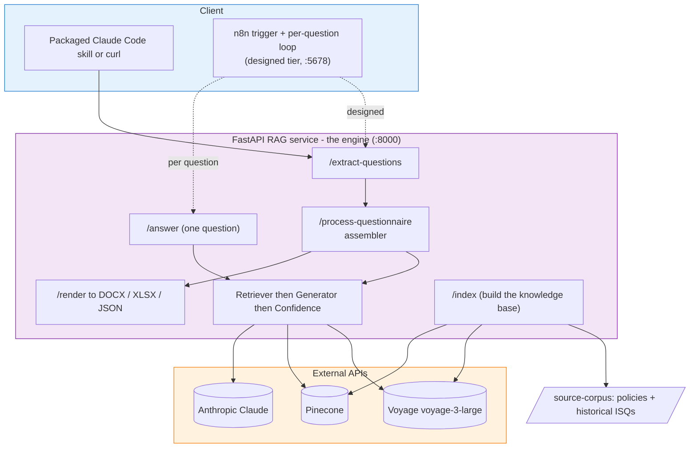

# Architecture

ISQ Agent answers supplier Information Security Questionnaires for Northstar Labs, grounding every answer in the company's own policies and historical ISQ responses, and flagging anything it isn't sure about. It's a two-tier system. The engine tier is the FastAPI RAG service (`:8000`): the retrieval and answer engine where almost all the code lives, and the part that's actually shipped in v1. The orchestration tier is n8n (`:5678`): the workflow layer that ingests an inbound questionnaire and drives the engine per question. That tier is designed but not built in v1 (more on that below). The working path today runs through the engine directly.

## Diagram

## The two tiers

**The engine tier, the FastAPI service, is what ships.** It owns all the AI logic: extracting questions, retrieving from the knowledge base, generating grounded answers, scoring confidence, and rendering the filled outputs. It's stateless per request. The only stateful thing the engine depends on is the Pinecone index, which it builds via `/index`. If you want to run the whole flow today, you've two honest options: install the packaged Claude Code skill and point it at a questionnaire, or hit the endpoints directly with curl. Both drive `/extract-questions` then `/process-questionnaire`, which does all the per-question work and assembles the final envelope.

**The orchestration tier, n8n, is designed, not built.** The original plan had n8n handling the inbound trigger (a form upload or an email), the document parsing, the per-question loop calling `/answer`, and the delivery of download links. That's the dotted path in the diagram, and it's a real plan, but it isn't wired up in v1. I'm being straight about that because the value of this submission is the engine, and the engine doesn't need n8n to run. The `/process-questionnaire` assembler exists precisely so the loop-and-assemble logic lives in the engine where it's tested, rather than being trapped in n8n nodes. So the orchestration is proven in code; the n8n surface around it is the next layer, not a built one.

## Design decisions

### (a) The two-tier split

Orchestration and AI logic have different shapes, so they get different homes. Orchestration is glue: triggers, file I/O, format detection, looping, delivery. That's exactly what a workflow tool like n8n is good at, and it's the kind of thing you want to change without touching the engine. The AI logic (retrieval, generation, confidence) is where the actual thinking happens, it needs proper tests, and it benefits from being a plain stateless HTTP service you can scale by adding containers. Keeping them apart means the engine has one job and does it well, and the orchestration can be swapped or rebuilt without putting the answer quality at risk. It also let me build and ship the engine first, which is the part that matters.

### (b) Hybrid confidence

Two signals decide whether an answer is trustworthy, because neither alone is honest enough. Signal one is the model scoring itself across four dimensions: `cites_policy` (0.40), `on_topic` (0.25), `vendor_tone` (0.20) and `complete` (0.15). Those weights sum to 1.0 and grounding is weighted heaviest on purpose: an ungrounded answer is the worst failure mode for an audit-facing tool, and a partial-but-correct answer is recoverable where a complete-but-wrong one isn't. The model's self-score is nuanced but it can over-claim.

Signal two is a retrieval-similarity sanity check that keeps the model honest. When retrieval was actually weak (top chunk score below 0.7) but the model still claimed strong grounding (`cites_policy` at or above 0.9), the aggregator docks `cites_policy` by 0.2. It only checks a boastful model; it never second-guesses a cautious one. An answer is flagged for review if the aggregate is below 0.6, OR `cites_policy` is below 0.5, OR the model raised a review reason of its own. Any one trigger is enough. The weights and thresholds are all public in the code so a reviewer can audit the bias rather than take it on trust.

### (c) Source weighting in code, after retrieval, before the floor

Pinecone returns the nearest chunks unfiltered, then the retriever applies source weighting in code: policies stay at ×1.0, historical ISQs are nudged down to ×0.95, reflecting the brief's preference for official policy documents over past answers. The ordering is the load-bearing bit. The weighting happens BEFORE the `min_score` 0.5 floor, not after. That matters because the ×0.95 can push a borderline historical ISQ under the floor, and the honest thing is to drop it. If we floored first and weighted second, that match would survive when it shouldn't. Weighting in code (rather than baking it into the embeddings) also keeps the policy preference visible and tunable instead of hidden in vector space. The retriever returns at most `top_k` = 5 chunks, sorted by weighted score descending.

### (d) Deterministic vector IDs

Re-indexing has to be idempotent, so vector IDs are derived from the filename, not random. The ID format is `{short_code}-p{page}-c{idx}` for PDFs (which carry real page numbers, good for citations) and `{short_code}-c{idx}` for DOCX (one text blob, no page). The short code takes the first character of each token in the filename, keeping pure-digit tokens whole so ISQ numbers survive (so `Northstar_Labs_Information_Security_Policy.pdf` becomes `nlisp`). Because the same corpus always regenerates the same IDs, a re-index is a clean upsert-replace: no orphaned vectors, no duplicates. `force_reindex` wipes first then rebuilds; without it, a populated index is a no-op.

### (e) Cross-system observability via X-Request-Id

When a request carries an `X-Request-Id` header, the engine echoes it straight back on the response. That gives you one ID to grep across systems: the n8n execution view (when that tier exists) and the engine's structured logs both carry the same ID, so you can trace one question end to end instead of guessing. It's a small thing to wire in early and a real pain to retrofit later, so the answer/extract/render/process endpoints echo it from day one.

## The pipeline

The flow is: `/extract-questions` pulls the numbered questions out of an inbound questionnaire, then `/process-questionnaire` takes that list and does the work. The assembler is the integration capstone. For each question it runs the same three steps `/answer` runs for a single question: the Retriever finds the top-k grounded chunks, the Generator (a forced Claude tool call) drafts a vendor-appropriate answer with citations and a four-dimension self-score, and the Confidence aggregator folds that into a single verdict with the retrieval sanity check. Once every question is answered, the assembler folds the per-question results into one canonical envelope: `questionnaire_meta`, `answers[]` and `summary_metrics`. That envelope is what every renderer consumes, so `/render` can produce DOCX, XLSX or JSON from the exact same shape. Separately, `/index` builds the Pinecone knowledge base from the source corpus: it discovers the policy and historical-ISQ files, processes and chunks them, embeds them in a single batched Voyage call, and upserts them with the deterministic IDs above.

## Failure handling

Failure is isolated, not fatal. If a single question's generation throws, the assembler catches it, logs it (it's never silently swallowed), and writes an answer entry with `confidence` set to null. The rest of the questionnaire still completes. The summary roll-up is built for exactly this: a null-confidence answer always counts as flagged, and it's left out of the average confidence (a failure is the absence of an answer, not a zero-confidence one). So a flaky question becomes a visible "needs review" line in the output rather than a crashed run.

At the run level there's a banner. It's `all_failed` when every question's generation failed, `all_flagged` when every question is flagged (which often means the corpus doesn't cover this questionnaire's domain), and null otherwise. `all_failed` is the more specific case and wins when both are true, since an all-failed run is by definition also all-flagged.
